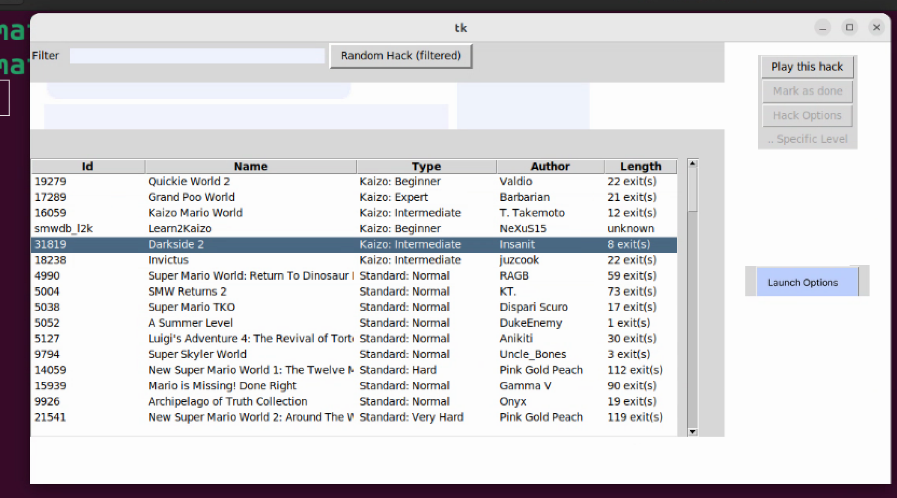

# Purpose of this Program
This program assists with managing and launching SMW Romhack files by automating download, patching, local file management.

A searchable database is provided, allowing any hack in the database to be automatically patched and loaded into RetroArch or consoles  on demand - by searching and specifying the patch number.

The database collected allows automating operations such as "Choose and launch a random game from the collection based on criteria X, Y, and Z"

This is a sample release.
This program is incomplete and a work in progress.

# Running the program
   This program requires Python 3.10.x.
   The program is written to run on Linux, or Windows Subsystem for Linux
   *  Please install the pre-requisites Including: Flips, Asar,
      and a Legally-acquired original SMW rom as discussed in the Section Pre-requisites.

 Download
    Download FLIPS and  the Program from
      https://github.com/Belthasaran/rhtools/releases

      For Windows users, I recommend extracting all 3 files in C:\SNESGAMING
      rhtools-0.2.tar.gz
      rhtools-sampledata-202308.tar.gz
      flips-rhtool-0.1_2023.tar.gz
      
# Graphical User Interface

 GUI version is for test purposes, and this tool only has a limited subset of SMW game directory listings.
 (More complete data is available for the text-based Search-Only tool
  rhinfotool https://github.com/Belthasaran/rhinfotool/releases/ )
 
 This program contains a GUI https://github.com/Belthasaran/rhtools/blob/main/gui.py

 After installing the pre-requisites:
    You can run the GUI by launching gui.py
      python3 gui.py



    Currently the GUI only supports listing all Hacks in
    the database and choosing a hack.   

    The "Play this hack" button - Automatically applies the
    patch to the vanilla SMW game and Launches the patched
    file (If successful)

    You can search for Romhacks in the database from the command line:
      python3 search.py kaizo

    (Currently the database only contains a limited selection)

    You can automatically download, patch, and ready a hack to run
    by launching pb_repatch.py
       for example, to download and Patch Hack number 11374,
       DRAM World: 
      # python3 pb_repatch.py 11374

    You can send a ROM to the SNES by running pb_sendtosnes.py
      # python3 pb_sendtosnes.py rom/blah.sfc

       This requires an Emulator be installed Or  Usb2snes AND
       The QUSB2SNES  sendtosd2snes.exe tool.

      This requires Editing the llaunch_rand.sh  script
      according to your local Needs.

# Prerequisites

Requires PYTHON3

## Base ROM

This program requires a legally-acquired base rom to use.
This file should be vanilla SMW.

Name the file smw.sfc  and Place the file in the same folder you
run the program from

## FLIPS and ASAR

- You need the floating IPS Patcher flips And ASAR 1.71 installed.

- Please use the see the flips-rhtool package from
      https://github.com/Belthasaran/rhtools/releases

  The flips and asar binaries must be placed in either a specific folder or the present working directory.

  The release zip files include all source code and are intended to be exracted into the C:\snesgaming folder.

- Those products are both under the GNU GPL.  For your convenience: This website contains
a copy of them:  Download  flips-rhtool-0.1_2023.tar.gz

If you are a Windows Subsystem for Linux user,  then just use 7-zip to extract the file and its subfolders in C:\SNESGAMING

Linux users can extract the archive and then copy  bin/flips and bin/asar   To  /usr/local/bin.
  tar zxvf flips-rhtool-0.1_2023.tar.gz
  sudo cp bin/flips /usr/local/bin
  sudo cp bin/asar /usr/local/bin

## Linux

This program is written on Linux to run on Linux.

The following steps are for Windows users.

Windows users should still be able to run this program:
    * First: install Windows Subsystem for Linux (see below for details)
    * Next: download and install MobaXterm

## Setup for Windows Users

Windows users: Please create a directory named C:\SNESGAMING
and put these scripts in a folder named RHTOOLS below C:\SNESGAMING

When you install ASAR and FLIPS as required,  create a
folder called C:\SNESGAMING\bin   then copy The linux versions of
asar and flips to that bin folder.

## Windows Subsystem for Linux

I recommend the following article:
https://ubuntu.com/tutorials/install-ubuntu-on-wsl2-on-windows-10#1-overview

In short - the first steps are:

  wsl --set-default-version 2

  wsl install -d ubuntu

After you have installed your environment,  Launch  MobaXterm, 
choose "Start Local Terminal" and double click the WSL-Ubuntu user Session.

If there is no WSL-Ubuntu User session, then  Right click "User Sessions",
pick "New Session",  then Choose WSL on the far Right, and
change Distribution to "Ubuntu",  then click OK.

Open a  Ubuntu-WSL Tab

then

    cd /mnt/c/snesgaming/rhtools

    python3 gui.py


## PIP Modules:
   Please install PIP modules   before running 

pip3 install -r requirements.txt

Please install:

    pip3 install ipfshttpclient

    pip3 install cryptography

    pip3 install requests

    pip3 install compress


## Database Maintenance


PROCEDURE TO ADD A HACK TO THE DATABASE:


To add hack with ID example1234

1. Create folders  zips/ hacks/

2.   create  hacks/example1234
     This should be a text file in JSON format.

The JSON file should contain Information which identifies the hack..

Starting with 0.4 you can use the 'python3 db_makehack.py uniqueid'  Utility to help create the JSON file.

Be prepared to answer these questions

    $ python3 db_makehack.py local_123456
    Hack name:test hack
    Enter author names:tester
    Description:this is just a test
    Length (example: "5 exits"), or unknown:2 exits
    Please choose type from above list: 1
    Is the hack a demo?  Yes or No: No
    Specify tags
    Enter a tag to add, or -tag to remove a tag, +add to create a new tag, list to display common tags, or done to accept: normal
    Selected tags = ['normal']
    Enter a tag to add, or -tag to remove a tag, +add to create a new tag, list to display common tags, or done to accept: done
    That done does not seem to be in the list of known tags -  Try +tag 
    Enter optional author URL (or leave blank): 
    Enter URL for information about the hack (or leave blank): 
    Enter direct URL to the raw Zip file (or leave blank): http://example.com/download/local123456.zip

EXAMPLE:

{
    "added": "2023-09-03", "author": "test", "authors": "test",
    "demo": "No", "description": "test", "id": "example1234",
    "length": "unknown", "name": "example hack", "rating": [ "0.0" ],
    "tags": [
        "traditional"
    ],
    "tags_href": "", "type": "Standard: Normal",
    "url": "https://example.com/info/smw_example",
    "name_href": "//dl.example.com/download/smw_example.zip",
    "author_href": "/?p=profile&id=example"
}


3.  Create   zips/example1234.zip

The .zip file should contain A file named example1234.bps   with the Patch data.
the Patch must be against the vanilla SMW game in BPS file format.

The filename is generally important, but it Must end with .bps, And there should
be only one BPS file within the .zip file.


4.  Run mkblob
     python3 mkblob.py  example1234

     The program mkblob will Automatically extract the ".zip" file and apply the patch.
     If the patching is successful, then the BPS blob will be saved to the blobs/ directory,
     And  hacks/example1234  will be updated to add Verification checksums, and
     a unique key for the blob.   The BPS will be compressed and encrypted for the purpose
     of verifying integrity when launching or using the patch later.

     Important Note: If you are intending to distribute the patch blob:
     The blob file is encrypted and unreadable without the key which is entered into hacks/example1234
     by mkblob -- running mkblob a second time would cause a loss of the previous key - Both files
     (or the database file) are required to use the patch blob.

     The output looks like:

     $ python3 mkblob.py example

example.bps
The patch was applied successfully!
::: {'added': '2023-09-03', 'author': 'test', 'authors': 'test', 'demo': 'No', 'description': 'test', 'id': 'example', 'length': 'unknown', 'name': 'example hack', 'rating': ['0.0'], 'tags': ['traditional'], 'tags_href': '', 'type': 'Standard: Normal', 'url': 'https://example.com/info/smw_example', 'name_href': '//dl.example.com/download/smw_example.zip', 'author_href': '/?p=profile&id=example', 'patch': 'patch/Rf_sNY6-VeRrbd3ehCVZ8r6qsJcsGOsg', 'pat_sha224': '07886ea9791a671581e7bd2e5bc36999bf9e1598838d5b7f505f173a', 'pat_sha1': '556ada885b72ba0c060d7a569a357501509c2b7a', 'pat_shake_128': 'Rf_sNY6-VeRrbd3ehCVZ8r6qsJcsGOsg', 'result_sha224': 'fdc4c00e09a8e08d395003e9c8a747f45a9e5e94cbfedc508458eb08', 'result_sha1': '6b47bb75d16514b6a476aa0c73a683a2a4c18765', 'result_shake1': '1SNFIbeimj0ck4t5ylWe6a80jqt9gYkL', 'rom': 'rom/example_1SNFIbeimj0ck4t5ylWe6a80jqt9gYkL.sfc', 'patchblob1_name': 'pblob_example_a45829efe5', 'patchblob1_key': 'dGRJUDJWc0txZXA2b2E5a0lxa1dQV2d1c2VQZWZ2aW14SU1MMzJFMWc1ND0=', 'patchblob1_sha224': 'a45829efe55990d404d9136207f9ded73793b9b9e761195baf2e3d31', 'romblob_salt': 'kyjCSqrKdeH3l4_t5gbcbQ==', 'romblob_name': 'rblob_example_f1fc80f5d9'}
rom/example_1SNFIbeimj0ck4t5ylWe6a80jqt9gYkL.sfc


    At this point the  hacks/example  File has Already been updated and is ready to add to the database.

5.      bash do_addhacks.sh
     This script will scan the  hacks/  directory  and attempt to add all hacks found in hacks/ to the database.

     NOTE:  If a hack by that same ID is already in the local database, then it will be removed and replaced with
     the items found in hacks/.   

     Two hacks should Never have the same ID specified.
     Do not use a numeric ID number, unless the hack is on SMWC, and your ID number matches theirs!


# PSETS

  OPTIONAL STEP when recording hacks in Database ,   create a  patchblob bundle or pset.
    A pset is a .zip file containing many hacks sorted by Id prefix.
    Each pset Zip appears as an entry in psets.dat.

    This allows creating a series of zip files which contain thousands of patches,
and the correct .Zip file and patchblob can be automatically downloaded from a URL listed
in psets.dat

  For example  the following psets.dat entry describes a zipfile for hacks whose Id starts with "yy" or with "0":
       [ 
         {
             "hash": "blah blah",
             "ipfs": "blah blah",
             "key": "blobs/setpblob_pblob_yy_0.zip",
             "publicUrl": "https://example.com/setpblob_pblob_yy_0.zip"
         }
        ]

     The publicUrl and ipfs keys provided are means of downloading the bundle of patches.

     $ unzip -v setpblob_pblob_12_0.zip 
     Archive:  setpblob_pblob_12_0.zip
      Length   Method    Size  Cmpr    Date    Time   CRC-32   Name
     --------  ------  ------- ---- ---------- ----- --------  ----
      144784  Defl:X   144809   0% 09-25-2022 19:40 f25b70a5  pblob_12113_f9265e50c7
      195604  Defl:X   195634   0% 09-25-2022 19:41 671f7f23  pblob_12147_9769da55a4
      382336  Defl:X   382396   0% 09-25-2022 19:41 484c01d0  pblob_12161_d771eb4106
      443780  Defl:X   443850   0% 09-25-2022 19:41 e9fb1b6f  pblob_12162_b350b852de
      280112  Defl:X   280157   0% 09-25-2022 19:41 e8df416c  pblob_12310_f82fac72b5
      187952  Defl:X   187982   0% 09-25-2022 19:41 2ea40806  pblob_12691_6f8c3e795f
      360992  Defl:X   361052   0% 09-25-2022 19:41 f037e71f  pblob_12718_4722953c1f
      181840  Defl:X   181870   0% 09-25-2022 19:41 2cc49613  pblob_12725_e2df438cde
      355440  Defl:X   355495   0% 09-25-2022 19:41 9b012201  pblob_12758_cf7edded64
       31980  Stored    31980   0% 09-25-2022 19:41 10b6d8b3  pblob_12794_5910f4da19
      356152  Defl:X   356207   0% 09-25-2022 19:41 02138bde  pblob_12810_b6d84ce128
      170576  Defl:X   170606   0% 09-25-2022 19:41 a23b70d6  pblob_12812_05b7bfe1d0
     1552124  Defl:X  1552364   0% 09-25-2022 19:41 042e4376  pblob_12826_bef1d64bc8
       40008  Defl:X    40018   0% 09-25-2022 19:41 65af08e3  pblob_12884_9924411293
      337380  Defl:X   337435   0% 09-25-2022 19:41 06fcc7c8  pblob_12916_3c3da10642
      425324  Defl:X   425389   0% 09-25-2022 19:41 4da45e40  pblob_12920_a2ded008d2
      269748  Defl:X   269793   0% 09-25-2022 19:41 b8bd4b02  pblob_12923_4a82423cd8
      400436  Defl:X   400501   0% 09-25-2022 19:41 e00a8a47  pblob_12947_09eb4fe759
       70428  Defl:X    70443   0% 09-25-2022 19:41 54265079  pblob_12979_581435c6df
    --------          -------  ---                            -------
     6186996          6187981   0%                            19 files

  
# Example Level loading Patch: Storks


Storks, Apes, and Crocodiles is a SMW hack.  This particular one has been assigned game id number: 27282.

The URL for more information about the game is at <A HREF="https://www.smwcentral.net/?p=section&a=details&id=27282" REL="nofollow">https://www.smwcentral.net/?p=section&a=details&id=27282</A>

In the game of Storks... I just wanted to be able to try playing any level number, not just level number 1.

after a few days with a debugger, I came up with this patch variant

```
; I just want to try playing levels in Storks other than Level 1...
;
; asar temp3.asm storks_copy2.sfc ; snes9x -conf snes9xb.conf storks_copy2.sfc
;  Found valid level numbers: #$01, #$02, #$03, #$04, #$05, #$06, #$07, #$09, #$0A, #$0B, #$0C, #$0D, #$0E, #$0F, #$10, #$11, #$12
!levelnumber = #$0F
org $85d856
    JSR Main ;jsr n n   +2 d85a  (length=3)
    BNE $3   ; len=2    (bne,       length=2) ;  bne n
    JMP $d8a5 ; len=3     (jmp $nnnn, length=3) ;  jmp n n   ; +3
org $85f8f0
Main:
    LDA !levelnumber
    STA $13bf
    CPX #$03
    BNE .etest
        LDA $0109
    RTS
    .etest:
    RTS
```

In order to make the local modification Which alters the game Storks to let me play any level usable in rhtools,  I edited asm1.py  to add  a condition to get_a_patch() for patch number 20,
then I added this function  get_c_patch(pid,chosenlid)

Finally, I add the following entry to pnums.dat

```
27282 20
```

And then log the Valid level ID numbers in log.txt

```
> 27282 2 20 2 1694519499 _ 0x0
> 27282 2 20 2 1694519499 _ 0x0
> 27282 3 20 3 1694519556 _ 0x0
> 27282 4 20 4 1694519572 _ 0x0
> 27282 5 20 5 1694519585 _ 0x0
> 27282 6 20 6 1694519601 _ 0x0
> 27282 7 20 7 1694519624 _ 0x0
> 27282 7 20 7 1694519637 _ 0x0
> 27282 8 20 8 1694519650 _ 0x0
> 27282 9 20 9 1694519664 _ 0x0
> 27282 A 20 10 1694519705 _ 0x0
> 27282 B 20 11 1694519721 _ 0x0
> 27282 C 20 12 1694519734 _ 0x0
> 27282 D 20 13 1694519748 _ 0x0
> 27282 E 20 14 1694519762 _ 0x0
> 27282 F 20 15 1694519776 _ 0x0
> 27282 10 20 16 1694519830 _ 0x0
> 27282 11 20 17 1694519842 _ 0x0
> 27282 12 20 18 1694519855 _ 0x0
```

After doing this, the data mining process is complete, and I can load Any random storks level by running

python3 pb_randomlevel.py 27282

I can also specify a level directly through, for example

python3 pb_lvlrand.py 27282 0x0F


